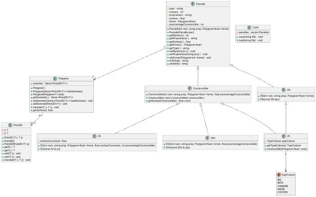

# Compte Rendu - TP4 : Gestion de Parcelles avec Héritage
**Louis VAILLANT,
Damien BUREAU,
Titouan COPIN,
Simon CAU**


## 1. Structure du Code et Diagramme de Classes

### 1.1 Architecture Générale

Le projet implémente un système de gestion de parcelles en utilisant une hiérarchie de classes C++ avec héritage. L'architecture est organisée en trois niveaux :



### 1.2 Classes de Base

**Point2D\<T\>** : Représente un point dans un plan 2D avec des coordonnées génériques.
- Attributs : `x: T`, `y: T`
- Méthodes : constructeurs, getters/setters, `translate()`

**Polygone\<T\>** : Représente une forme géométrique composée de sommets.
- Attributs : `sommets: vector<Point2D<T>>`
- Méthodes : gestion des sommets, `getSurface()`, `translate()`

**Parcelle** : Classe de base pour toutes les parcelles cadastrales.
- Attributs protégés : `type`, `numero`, `proprietaire`, `surface`, `forme`, `pourcentageConstructible`
- Méthodes : getters/setters, `toString()`, `serialize()` (virtuelle pure)

### 1.3 Hiérarchie d'Héritage

**Constructible** (classe abstraite) : Hérite de `Parcelle` avec héritage **virtuel**
- Définit la méthode virtuelle pure : `getSurfaceConstructible() const = 0`
- Représente toutes les parcelles où l'on peut construire

**ZAU (Zone à Urbaniser)** : Hérite de `Constructible`
- Parcelle destinée à être urbanisée
- Implémente : `getSurfaceConstructible()` = `surface × pourcentageConstructible / 100`

**ZU (Zone Urbaine)** : Hérite de `Constructible`
- Parcelle déjà urbanisée
- Attribut supplémentaire : `surfaceConstruite`
- Implémente : `getSurfaceConstructible()` = `(surface × pourcentageConstructible / 100) - surfaceConstruite`

**ZN (Zone Naturelle)** : Hérite directement de `Parcelle`
- Parcelle non constructible (forêts, parcs naturels)

**ZA (Zone Agricole)** : Héritage multiple de `ZN` et `Constructible`
- Parcelle agricole avec culture spécifique
- Attribut : `typeCulture` (enum : BLE, MAIS, CHANVRE, VACHE, COCHON)

## 2. Intérêt de l'Héritage

### 2.1 Héritage Simple

**Avantages :**
- **Réutilisation du code** : Les classes dérivées héritent automatiquement des attributs et méthodes de `Parcelle`
- **Polymorphisme** : Possibilité de manipuler toutes les parcelles via un pointeur `Parcelle*`
- **Extensibilité** : Ajout facile de nouveaux types de parcelles


### 2.2 Héritage Virtuel

L'héritage virtuel de `Constructible` depuis `Parcelle` est **crucial** pour éviter le problème du "diamant" avec `ZA` :

```
       Parcelle
       /      \
      /        \
  virtual   virtual
    /            \
   ZN        Constructible
    \            /
     \          /
         ZA
```

**Sans héritage virtuel** : `ZA` aurait **deux copies** de `Parcelle` → ambiguïté
**Avec héritage virtuel** : `ZA` n'a qu'**une seule instance** de `Parcelle` → pas d'ambiguïté

**Conséquence importante** :
Avec l'héritage virtuel, la classe la plus dérivée (ex: `ZU`, `ZAU`) doit **appeler explicitement** le constructeur de la classe de base virtuelle :

```cpp
ZAU::ZAU(int num, string prop, Polygone<float> forme, float pctConstr)
: Parcelle(num, prop, forme),      // ← Appel obligatoire !
  Constructible(num, prop, forme)

```

### 2.3 Méthodes Virtuelles Pures

La méthode `getSurfaceConstructible()` est **virtuelle pure** dans `Constructible` :

```cpp
virtual float getSurfaceConstructible() const = 0;
```

**Intérêts :**
- Impose à chaque classe dérivée d'implémenter sa propre logique de calcul
- `Constructible` devient une classe abstraite (impossible à instancier)
- Garantit le contrat d'interface : toute zone constructible peut calculer sa surface constructible

## 3. Tests Unitaires

### 3.1 Organisation des Tests

Les tests utilisent **Google Test** (gtest) et sont organisés par classe.

### 3.2 Intérêt des Tests

1. **Validation du comportement** : S'assure que chaque classe fonctionne comme prévu
2. **Détection de régressions** : Les tests échouent si une modification casse du code existant
3. **Documentation vivante** : Les tests montrent comment utiliser les classes
4. **Confiance dans le code** : Permet de refactoriser en toute sécurité

## 4. Problèmes Rencontrés et Solutions

### 4.1 Héritage Virtuel et Constructeurs

**Problème** : `getNumero()` retournait 0 au lieu de la valeur attendue.

**Cause** : Avec l'héritage virtuel, `Constructible` n'initialise pas vraiment `Parcelle`. C'est la classe finale (`ZAU`, `ZU`) qui doit le faire.

**Solution** : Appeler explicitement `Parcelle(...)` dans les constructeurs de `ZAU` et `ZU`.

## 5. Conclusion

Ce projet illustre parfaitement les concepts avancés de la POO en C++ :
- **Héritage simple et multiple** pour modéliser des relations "est-un"
- **Héritage virtuel** pour résoudre le problème du diamant
- **Polymorphisme** via méthodes virtuelles
- **Classes abstraites** pour définir des interfaces
- **Tests unitaires** pour garantir la qualité du code

L'architecture permet une extension facile (ajout de nouveaux types de parcelles) tout en maintenant la cohérence et la réutilisabilité du code.
