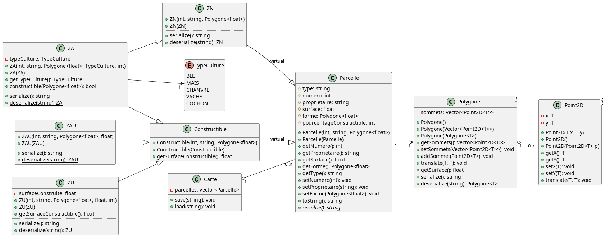

# Compte Rendu - TP4 : Gestion de Parcelles avec Héritage
> **Louis VAILLANT, Damien BUREAU, Titouan COPIN, Simon CAU**


## 1. Structure du Code et Diagramme de Classes

### 1.1 Architecture Générale

Le projet implémente un système de gestion de parcelles en utilisant une hiérarchie de classes C++ avec héritage. L'architecture est organisée en trois niveaux :



### 1.2 Classes de Base

**Point2D\<T\>** : 
La classe point2D représente un point dans le plan cartésien composé de deux coordonnées x et y qui sont en template comme demandé dans le sujet du TP. La classe possède un constructeur par défault, par paramètres ou par recopie. On a codé des méthodes translate pour pouvoir déplacer un point, soit sur un seul axe, soit sur les deux en même temps. 

- Attributs : `x: T`, `y: T`
- Méthodes : constructeurs, getters/setters, `translate()`

**Polygone\<T\>** : La classe Polygone regroupe une série de points pour former une figure géométrique complète. Elle gère une liste ordonnée de sommets. Afin de stocker les points, nous avons décidé d'utiliser un std::vector afin de pouvoir facilement ajouter et retirer des points. On gère dans cette classe le calcul de la surface en utilisant la formule donnée dans le TP.

- Attributs : `sommets: vector<Point2D<T>>`
- Méthodes : gestion des sommets, `getSurface()`, `translate()`

**Parcelle** : Classe de base pour toutes les parcelles cadastrales.
- Attributs protégés : `type`, `numero`, `proprietaire`, `surface`, `forme`, `pourcentageConstructible`
- Méthodes : getters/setters, `toString()`, `serialize()` (virtuelle pure)

### 1.3 Hiérarchie d'Héritage

**Constructible** (classe abstraite) : Hérite de `Parcelle` avec héritage **virtuel**
- Définit la méthode virtuelle pure : `getSurfaceConstructible() const = 0`
- Représente toutes les parcelles où l'on peut construire

**ZAU (Zone à Urbaniser)** : Hérite de `Constructible`
- Parcelle destinée à être urbanisée
- Implémente : `getSurfaceConstructible()` = `surface × pourcentageConstructible / 100`

**ZU (Zone Urbaine)** : Hérite de `Constructible`
- Parcelle déjà urbanisée
- Attribut supplémentaire : `surfaceConstruite`
- Implémente : `getSurfaceConstructible()` = `(surface × pourcentageConstructible / 100) - surfaceConstruite`

**ZN (Zone Naturelle)** : Hérite directement de `Parcelle`
- Parcelle non constructible (forêts, parcs naturels)

**ZA (Zone Agricole)** : Héritage multiple de `ZN` et `Constructible`
- Parcelle agricole avec culture spécifique
- Attribut : `typeCulture` (enum : BLE, MAIS, CHANVRE, VACHE, COCHON)

### 1.4 Sérialisation et désérialisation

Afin de simplifier l'implémentation des méthodes save() et load() de la classe Carte, nous avons fait le choix d'ajouter une méthode abstraite à la classe Parcelle pour la sérialisation. Celle-ci sera redéfinie dans les classes filles pour une implémentation plus spécifique. Chaque classe filles (ZN, ZA, ZAU et ZU) a également une méthode statique pour la désérialisation. Cela complexifie légèrement les classes, mais simplifie grandement le reste en plus de permettre un code plus propre. En effet, la façon de sérialiser et désérialiser est propre à chaque classe. Il est donc plus logique que ces fonctionnalités soient implémentées directement dans les classes en question.

```
Class --Serialization--> file --Deserialization--> Class
```

## 2. Intérêt de l'Héritage

### 2.1 Héritage Simple

**Avantages :**
- **Réutilisation du code** : Les classes dérivées héritent automatiquement des attributs et méthodes de `Parcelle`
- **Polymorphisme** : Possibilité de manipuler toutes les parcelles via un pointeur `Parcelle*`
- **Extensibilité** : Ajout facile de nouveaux types de parcelles


### 2.2 Héritage Virtuel

L'héritage virtuel de `Constructible` depuis `Parcelle` est **crucial** pour éviter le problème du "diamant" avec `ZA` :

```
       Parcelle
       /      \
      /        \
  virtual   virtual
    /            \
   ZN        Constructible
    \            /
     \          /
      \        /
       \      /
        \    /
          ZA
```

**Sans héritage virtuel** : `ZA` aurait **deux copies** de `Parcelle` → ambiguïté
**Avec héritage virtuel** : `ZA` n'a qu'**une seule instance** de `Parcelle` → pas d'ambiguïté

**Conséquence importante** :
Avec l'héritage virtuel, la classe la plus dérivée (ex: `ZU`, `ZAU`) doit **appeler explicitement** le constructeur de la classe de base virtuelle :

```cpp
ZAU::ZAU(int num, string prop, Polygone<float> forme, float pctConstr)
: Parcelle(num, prop, forme),      // ← Appel obligatoire !
  Constructible(num, prop, forme)

```

### 2.3 Méthodes Virtuelles Pures

La méthode `getSurfaceConstructible()` est **virtuelle pure** dans `Constructible` :

```cpp
virtual float getSurfaceConstructible() const = 0;
```

**Intérêts :**
- Impose à chaque classe dérivée d'implémenter sa propre logique de calcul
- `Constructible` devient une classe abstraite (impossible à instancier)
- Garantit le contrat d'interface : toute zone constructible peut calculer sa surface constructible

## 3. Tests Unitaires

### 3.1 Organisation des Tests

Les tests utilisent **Google Test** (gtest) et sont organisés par classe.

### 3.2 Intérêt des Tests

1. **Validation du comportement** : S'assure que chaque classe fonctionne comme prévu
2. **Détection de régressions** : Les tests échouent si une modification casse du code existant
3. **Documentation vivante** : Les tests montrent comment utiliser les classes
4. **Confiance dans le code** : Permet de refactoriser en toute sécurité

### Test unitaire de chaque classe :

***Point2D:***
 Le test de la classe Point2D permet de tester le bon fonctionnement des constructeurs, des méthodes de translations et de l'utilisation des templates.

Sortie console :

```
[----------] 8 tests from Point2DTest
[ RUN      ] Point2DTest.constructeurdefault
[       OK ] Point2DTest.constructeurdefault (0 ms)
[ RUN      ] Point2DTest.constructeurs
[       OK ] Point2DTest.constructeurs (0 ms)
[ RUN      ] Point2DTest.copie
[       OK ] Point2DTest.copie (0 ms)
[ RUN      ] Point2DTest.set
[       OK ] Point2DTest.set (0 ms)
[ RUN      ] Point2DTest.translateX
[       OK ] Point2DTest.translateX (0 ms)
[ RUN      ] Point2DTest.translateY
[       OK ] Point2DTest.translateY (0 ms)
[ RUN      ] Point2DTest.translate
[       OK ] Point2DTest.translate (0 ms)
[ RUN      ] Point2DTest.testdouble
[       OK ] Point2DTest.testdouble (0 ms)
[----------] 8 tests from Point2DTest (0 ms total)
```

***Polygone:***
 Le test de la classe Polygone permet de tester le bon fonctionnement des constructeurs, des methodes de translations et de l'utilisation des templates. De plus, il permet de tester une consigne du TP qui est de faire une copie en profondeur lors de l'appel du constructeur par copie.

 Sortie console :

```
[----------] 7 tests from PolygoneTest
[ RUN      ] PolygoneTest.Constructeur
[       OK ] PolygoneTest.Constructeur (0 ms)
[ RUN      ] PolygoneTest.Constructeurtriangle
[       OK ] PolygoneTest.Constructeurtriangle (0 ms)
[ RUN      ] PolygoneTest.add
[       OK ] PolygoneTest.add (0 ms)
[ RUN      ] PolygoneTest.replace
[       OK ] PolygoneTest.replace (0 ms)
[ RUN      ] PolygoneTest.translate
[       OK ] PolygoneTest.translate (0 ms)
[ RUN      ] PolygoneTest.surface
[       OK ] PolygoneTest.surface (0 ms)
[ RUN      ] PolygoneTest.copieprof
[       OK ] PolygoneTest.copieprof (0 ms)
[----------] 7 tests from PolygoneTest (0 ms total)
```

## 4. Problèmes Rencontrés et Solutions

### 4.1 Héritage Virtuel et Constructeurs

**Problème** : `getNumero()` retournait 0 au lieu de la valeur attendue.

**Cause** : Avec l'héritage virtuel, `Constructible` n'initialise pas vraiment `Parcelle`. C'est la classe finale (`ZAU`, `ZU`) qui doit le faire.

**Solution** : Appeler explicitement `Parcelle(...)` dans les constructeurs de `ZAU` et `ZU`.

## 5. Conclusion

Ce projet illustre parfaitement les concepts avancés de la POO en C++ :
- **Héritage simple et multiple** pour modéliser des relations "est-un"
- **Héritage virtuel** pour résoudre le problème du diamant
- **Polymorphisme** via méthodes virtuelles
- **Classes abstraites** pour définir des interfaces
- **Tests unitaires** pour garantir la qualité du code

L'architecture permet une extension facile (ajout de nouveaux types de parcelles) tout en maintenant la cohérence et la réutilisabilité du code.
